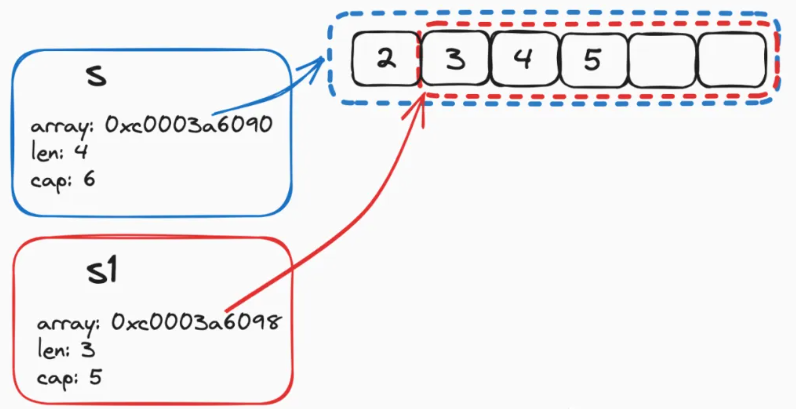

参考：https://mp.weixin.qq.com/s/uNajVcWr4mZpof1eNemfmQ

### 一、切片定义
```
type slice struct {
    // 指向起点的地址
    array unsafe.Pointer
    // 切片长度
    len   int
    // 切片容量
    cap   int
}
```

+ array：指向了内存空间地址的起点. 由于 slice 数据存放在连续的内存空间中，后续可以根据索引 index，在起点的基础上快速进行地址偏移，从而定位到目标元素
+ len：切片的长度，指的是逻辑意义上 slice 中实际存放了多少个元素
+ cap：切片的容量，指的是物理意义上为 slice 分配了足够用于存放多少个元素的空间. 使用 slice 时，要求 cap 永远大于等于 len


### 二、切片初始化

```
// 声明了但是未进行初始化，通过append添加值时会进行初始化，此时是个nil空指针
var s []int 

// make初始化方式一：会同时设置len和cap大小为8。
// 一旦设置了len长度，就代表对应位置被赋值了，默认值为0
s := make([]int,8)

// make初始化方式二：指定了长度和大小
s := make([]int,8,16)

// 初始化并完成赋值操作，此时cap和len大小均为3
s := []int{2,3,4}
```


```
// 初始化源码
func makeslice(et *_type, len, cap int) unsafe.Pointer {
    // 根据 cap 结合每个元素的大小，计算出消耗的总容量
    mem, overflow := math.MulUintptr(et.size, uintptr(cap))
    if overflow || mem > maxAlloc || len < 0 || len > cap {
        // 倘若容量超限，len 取负值或者 len 超过 cap，直接 panic
        mem, overflow := math.MulUintptr(et.size, uintptr(len))
        if overflow || mem > maxAlloc || len < 0 {
            panicmakeslicelen()
        }
        panicmakeslicecap()
    }
    // 走 mallocgc 进行内存分配以及切片初始化
    return mallocgc(mem, et, true)
}
```

### 三、切片传递

```
func main() {
	nums := make([]int, 5, 7)
	nums1 := nums[:4]
	fmt.Println(nums1, "cap: ", cap(nums1), "len: ", len(nums1))
	
	sliceOps(nums1)
	fmt.Println(nums1, "cap: ", cap(nums1), "len: ", len(nums1))
}

func sliceOps(nums []int) {
	// append 大于切片容量时，会重新分配数组，导致数组地址发生变化，因此不会影响原切片
	nums = append(nums, 1, 2, 3, 4)
	// nums = append(nums, 1)
	nums[0] = 5
}
```

切片是引用传递。在方法中对切片操作会影响原切片。
**但事实上**，切片属于值传递。传递时将原切片实例中的数组地址、cap、len等进行值拷贝，然后传递到局部方法中，因为副本中的数组地址和原切片的地址指向同一个数组，所以在局部方法中操作切片会影响到原切片。

局部方法中append方法可能会导致切片容量发生变化，进而数组重新分配地址，此时对切片的操作不会影响外部切片。


### 四、切片截取

s[a:b]  # 通过左闭右开的方式截取



```
func main() {
	nums := make([]int, 5, 7)
	nums1 := nums[1:4]
	fmt.Println(nums1, "cap: ", cap(nums1), "len: ", len(nums1))
	fmt.Println(nums, "cap: ", cap(nums), "len: ", len(nums))
}

// 从1开始截取，因此容量和长度都减少了
输出：
[0 0 0] cap:  6 len:  3
[0 0 0 0 0] cap:  7 len:  5
```

sliceOps 方法添加数据时，如果没超过数组容量大小，则会修改方法内部副本数据的数组以及len大小，但是对于外部的切片来说，数组的修改会同步，但是len大小不会同步，因此外部切片只改变了len长度以内的数据
切片传递本质是值传递，包括数据指针，len，cap，对切片引用的数组的操作会影响到外部切片，但是len的变化不会影响到外部，因此外部切片会根据len的大小输出切片内容
```
func main() {
	nums := make([]int, 5, 7)
	numsCut := nums[1:4]
	fmt.Println(numsCut, "cap: ", cap(numsCut), "len: ", len(numsCut))
	
	sliceOps(numsCut)
	fmt.Println(numsCut, "cap: ", cap(numsCut), "len: ", len(numsCut))
	fmt.Println(nums, "cap: ", cap(nums), "len: ", len(nums))
}

func sliceOps(nums []int) {
	// append 大于切片容量时，会重新分配数组，导致数组地址发生变化，因此不会影响原切片
	nums = append(nums, 1, 2, 3)
	nums[0] = 5
	fmt.Println(nums, "cap: ", cap(nums), "len: ", len(nums))
}

输出：
[0 0 0] cap:  6 len:  3
[5 0 0 1 2 3] cap:  6 len:  6
[5 0 0] cap:  6 len:  3
[0 5 0 0 1] cap:  7 len:  5
```


